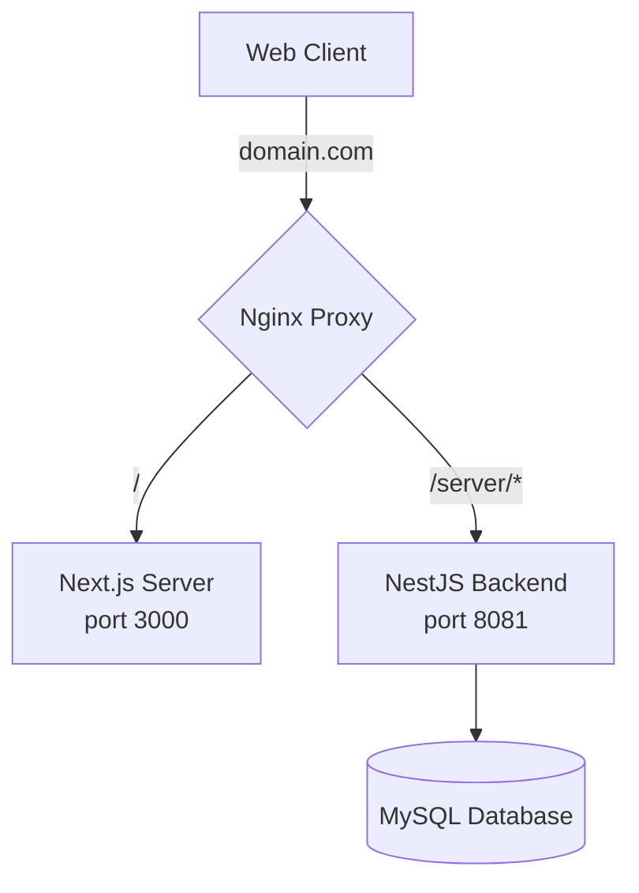

# Target Architecture & Local Development Setup

This document provides layout diagrams, technology stack tables, and step-by-step instructions for running the development environment.

---

## 1. System Architectures

### Development Topology (Incremental Development)
During development, the old frontend remains active in production. The developer spins up the Next.js dev server locally, mapping queries to the shared backend through a reverse proxy.

```mermaid
graph TD
    subgraph Client Port Space (Local)
        NFE[Next.js App <br> localhost:3000] -->|1. /api/* | Proxy[Next.js Rewrites Proxy]
        OFE[Old frontend <br> Current build] -.->|Direct API| BE[NestJS Backend <br> localhost:8081]
    end

    subgraph Service Space
        Proxy -->|2. Forward to 8081| BE
        BE -->|3. Query| DB[(MySQL Database)]
    end

    style NFE fill:#18181b,stroke:#00dc82,stroke-width:2px,color:#fff
    style BE fill:#1e1b4b,stroke:#6366f1,stroke-width:2px,color:#fff
```

### Production Topology (After Switch)
When the migration is complete, Nginx redirects all root queries (`/`) to the Next.js Node app port, leaving the NestJS REST paths mapped under `/server` or matching domains.



---

## 2. Tech Stack Comparison

| Component | Old Stack (`/front`) | Target Stack (`/nextjs`) |
| :--- | :--- | :--- |
| **Foundation** | HTML / JS Webpack | Next.js 16 (React 19) + TypeScript |
| **CSS System** | Vanilla CSS / SCSS files | Tailwind CSS v4 |
| **Primitive Blocks** | DHTMLX Suite (Commercial) | shadcn/ui + Radix UI |
| **API Fetching** | Axios instance | Native `fetch` with token injection |
| **Session State** | `window.global` state object | React Context + Zustand |
| **Router** | Custom hash-based hash location changer | File-system App Router |

---

## 3. Local Development Configuration

### Step 1: Start Database & Backend
Ensure your database has geodata loaded and start the NestJS server:
```bash
# Verify NestJS configuration is running
cd server
npm run start:dev
# Backend listens on port 8081
```

### Step 2: Configure Next.js Dev Proxy
In `nextjs/next.config.ts`, include rewrites to map frontend `/api` requests:
```typescript
import type { NextConfig } from "next";

const nextConfig: NextConfig = {
  async rewrites() {
    return [
      {
        source: "/api/:path*",
        destination: "http://localhost:8081/:path*",
      },
    ];
  },
};

export default nextConfig;
```

### Step 3: Set Up Local Environment Variables
Create a `nextjs/.env.local` file:
```env
NEXT_PUBLIC_API_URL=/api
NEXT_PUBLIC_WS_URL=http://localhost:8082
NEXT_PUBLIC_USE_MOCKS=false
```

### Step 4: Run the Development Server
```bash
cd nextjs
npm run dev
# Open http://localhost:3000
```
